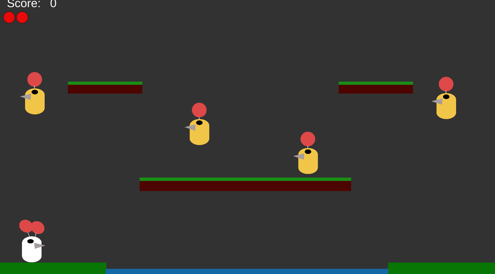

# Ballon-Fight

用Unity重现经典游戏《气球大战》。

- 实现了原游戏的基本玩法，跳跃、飞行、踩气球击杀、敌人死亡后重整等功能。玩家需要操作角色飞翔，并踩爆对面的头顶的气球，以及防止自己被对面踩爆。
- 实现了不同情况的得分，以及在UI上的显示。
- 制作了普通关卡、敌人会原地上下移动以及奖励关卡。
- 完成了主菜单的制作，以及不同场景间的切换。

Unity version: 2021.3.16f1c1

## 游戏截图 Images

主菜单，包含开始游戏以及操作介绍。

示例关卡一，目前敌人只能简单的上下飞行。

示例奖励关卡，玩家需要在规定时间内尽可能多的收集气泡，以获得更多分数。

